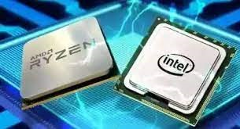

## Evolución de los  procesadores  en el campo educacional de un colegio  para estudiantes de terceros de bachillerato técnicos

### RESUMEN

Esta investigación  se basó  en  cuanto de conocimiento sobre  los procesadores  que deben tener  los estudiantes  de terceros como parte de su educación  además de eso se realizó  un pequeño compendio   histórico de los  procesadores  ya que los procesadores es la parte fundamental  de las computadoras   a lo en principio  se les conoció   como  transistores  resistencias  hasta que sé  que se   denominó  procesador    que hoy en día  se les conoce como microprocesadores  por su tamaño.  También en esta investigación se    abordó  los problemas que tienen los estudiantes especialmente  de tercero  BGU de un colegio y para ver las desventajas   y las ventajas  en conocimiento que llevan los estudiantes cuando se gradúan, aquí se aborda ese  tema  ya que   por el tema  de la pandemia  se volvió  mucho más complicado y  se  desnudó  las deficiencias  que se tiene en el campo de la educación especialmente  se   tocó  la educación en una ciudad con los servicios básicos  y  que tienen  internet  pero a un así  es   muy difícil  que los estudiantes aprendan  ya que ese tema   está clasificado  por la autoridad pertinente en  la malla curricular como  materia técnica.

